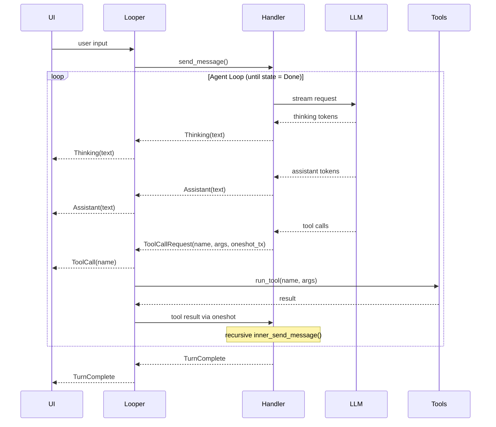

# looper-rs

## Demo

[Demo video (MP4)](./assets/Demo.mp4)

A very barebones, lightweight, agentic loop made to be plugged into any UI chat interface (CLI, web, desktop, etc).

The purpose of this is to avoid having to us Claude Code/Codex CLI which require sub processes of themselves to be spawned per user chat session. This become unscalable quickly with even just a few dozen sessions.

This tool is *not* meant to be as robust as Claude Code/Codex. It's meant to be a lighter weight, more practical solution to their heavy SDKs.

## Features

- Clear separation of concerns between the UI and the agentic loop and handlers
- Agentic loop with tool use (read/write files, grep, find, list directory)
- UI event stream (assistant messages, thinking, tool usage)
- Dynamic tool injection

## Architecture



## Setup

```sh
cp .env.example .env
# Add your OPENAI_API_KEY to .env
```

## Usage

```sh
cargo run
```
